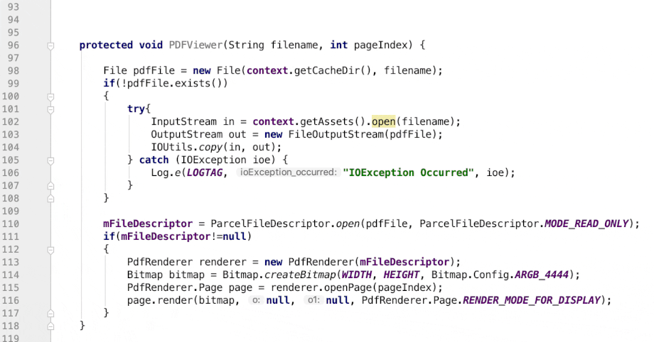

# ADANA: Automated Documentation of Android Apps
[*ADANA*](http://ADANA.si.usi.ch/) is a novel approach for automatically generating and injecting comments that describe a given piece of source code. This repository accommodates the follwing:

1. [**Publication**](./Publication/): 
   - [Published journal paper (PDF)](./Automated%20Documentation%20of%20Android%20Apps%20(TSE%202019).pdf)
     > E. Aghajani, G. Bavota, M. Linares-Vásquez and M. Lanza, "Automated Documentation of Android Apps," in IEEE Transactions on Software Engineering, vol. 47, no. 1, pp. 204-220, 1 Jan. 2021, doi: 10.1109/TSE.2018.2890652.

   - [Replication package](./replication_package/)

2. [**ADANA IDE Plugin (Android Studio)**](./Plugin/): See [_Plugin_](./Plugin/) directory for more details.

#### Demo
([HiRes](./Plugin/screens/adana-sample-HD.gif))

#### Screenshot

